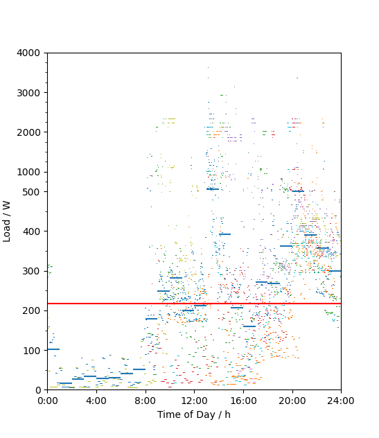
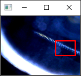

# LoadProfile

Scripts in Python to use a webcam to read a Ferraris energy meter and display the diurnal load profile

Python-Skripte, um mit einer Webcam einen klassischen Stromzähler abzulesen und dann ein Lastprofil darzustellen

## Funktionsweise

Man montiert eine Webcam vor dem Stromzähler, am einfachsten eine preiswerte Endoskopkamera mit Beleuchtung und 90°-Spiegel, die man mit Packband platt auf den Zähler kleben kann. Die Webcam richtet man so aus, dass sie ein möglichst kontraststarkes Bild der rotierenden Scheibe liefert. Dies nimmt man mit [VirtualDub](https://www.virtualdub.org/) auf. Einstellungen dort: kleinstmögliche Auflösung, ein Bild pro Sekunde, schlechteste Audioqualität. Es muss eine Audiospur mit aufgezeichnet werden, damit VirtualDub die Bildrate exakt einhält (konvergiert gegen 1.0000000 fps). Auf diese Art entsteht eine Sammlung an .avi-Dateien. Vorsicht: Nicht mit der Datei von heute die Datei von gestern überschreiben, sondern einen neuen Dateinamen wählen!

Jede der so entstandenen .avi-Dateien wird einzeln mit dem Skript **convert.py** verarbeitet. Dazu müssen an dessen Anfang der Name der bzw. Pfad zur .avi-Datei und die Koordinaten des Bildausschnitts mit den deutlichsten Helligkeitsänderungen (die beim Vorbeilauf der Markierung auf der Scheibe entstehen) eingetragen werden. Zur Kontrolle zeigt das Skript bei seinem Ablauf einige der Bilder und den gewählten Ausschnitt an, siehe die folgende Abbildung. (Man könnte alternativ schon bei der Aufnahme in VirtualDub einen Ausschnitt festlegen, aber den könnte man danach nicht wieder größer machen, falls er ungeschickt gewählt war.)

Das Skript convert.py schreibt zwei Dateien im .csv-Format, die sich in übliche Tabellenkalkulationsprogramme importieren lassen (aber Vorsicht mit Datumsformat und Dezimalpunkt!). Die eine .csv-Datei enthält das jeweilige Lastprofil (Liste von Zeitpunkten und der jeweiligen Last); mit Hilfe der anderen Datei mit der Endung _diagnostics.csv kann man überprüfen, ob die Durchläufe des Ferraris-Rads sauber erkannt worden sind.

Um die Zeitpunkte zu bestimmen, rechnet das Skript convert.py vom Zeitpunkt der letzten Änderung der .avi-Datei rückwärts. Falls Sie mit einer Kopie der ursprünglichen .avi-Datei arbeiten, sollte dieser Zeitpunkt der _letzten Änderung_ meist erhalten bleiben, anders als der Zeitpunkt der _Erzeugung_ der Datei. Aber prüfen Sie dies sicherheitshalber in den Eigenschaften der kopierten .avi-Datei.

Das Skript **collect.py** benutzt die so erzeugten .csv-Dateien, um das Diagramm des täglichen Lastgangs zu erzeugen (siehe Bild ganz oben). Es zeichnet alle Datenpunkte ein (für jede .csv-Datei in einer anderen Farbe) sowie die stündlichen Mittelwerte (blau) und das Tagesmittel (rot). Der Übersicht halber ist der obere Teil der vertikalen Achse gestaucht.

Am Anfang des Skripts collect.py lässt sich ein Korrekturwert eintragen, um den die angezeigte Last vermindert wird. Auf diese Art lässt sich der Verbrauch des Computers herausrechnen, der zur Aufzeichnung der Webcam dient.
